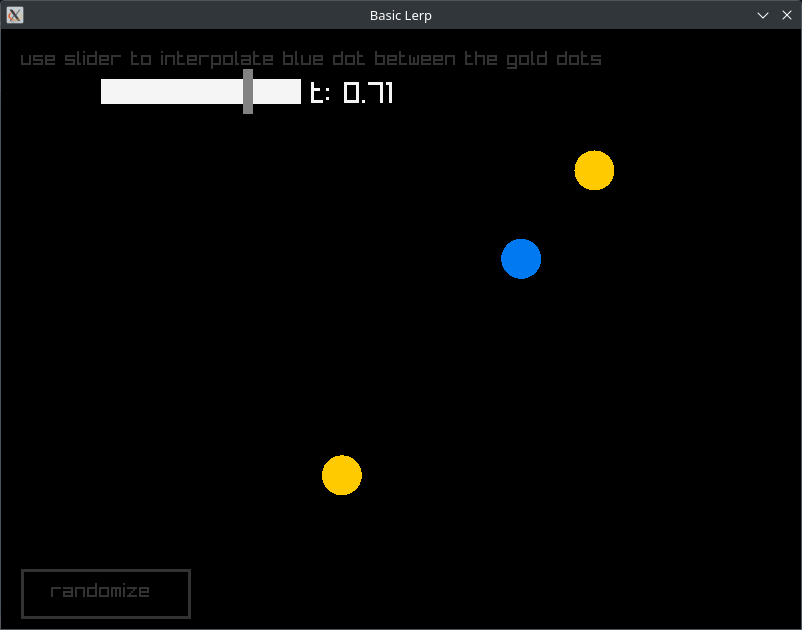
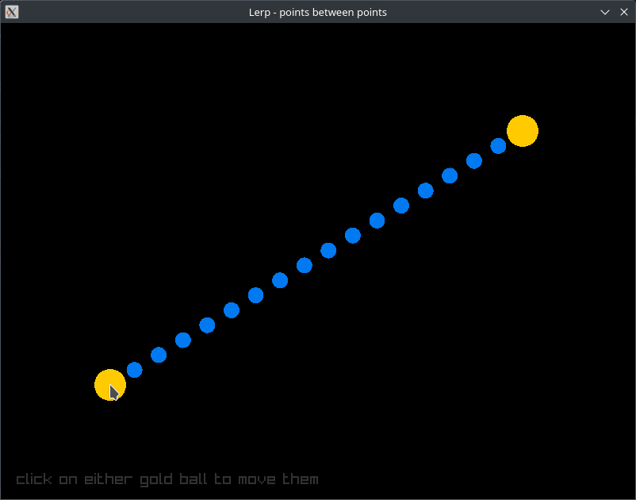

some programs that graphically demonstrate Lerp (Linear interpolate) functions

Made in the Odin programming language along with the Raylib graphics library.

https://odin-lang.org/

https://www.raylib.com/

Basic - shows a basic lerp with interactive slider and normalized value between two points

Over Time - Animates one point moving towards another point over time. Can interact with the source point and move it and the following point will dynamically adjust it's path.

Mid-points - Creates a series of equally spaced midpoints between two points. Both end points are interactive and the midpoints will dynamically adjust themselves

<picture>
      
</picture>
<picture>
      
</picture>